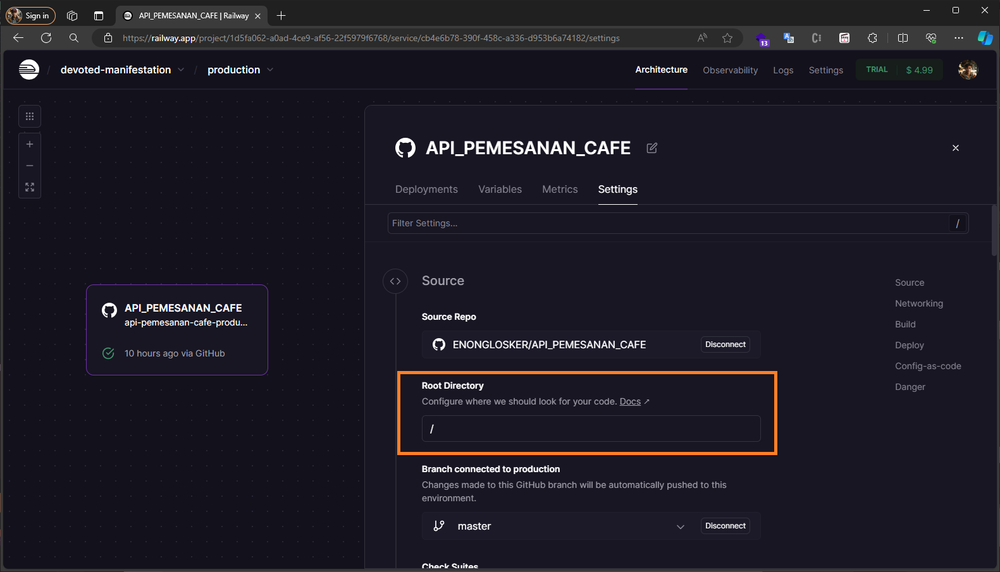
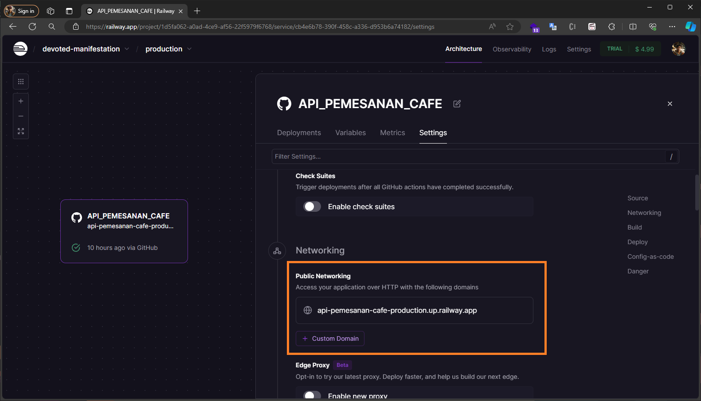
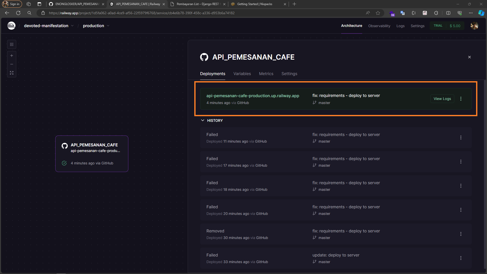

# Setup-Django-Deployments-Railway


---------------------------------------------------------------------------------------
## Setup
- 📗&nbsp;&nbsp; pastikan sudah membuat akun [Railway](https://railway.app/)
- 📗&nbsp;&nbsp; pastikan web/aplikasinya sudah ada terlebih dahulu serta sudah siap dan telah diuji secara lokal
- 📍&nbsp;&nbsp; install gunicorn
  ```
  pip install gunicorn
  ```
- 📍&nbsp;&nbsp; install whitenoise
  ```
  pip install whitenoise
  ```
📁&nbsp;&nbsp; setup whitenoise di settings.py

tambahkan pada static file
```
import os

STATIC_URL = 'static/'
STATICFILES_DIRS = [os.path.join(BASE_DIR, 'static')]
STATIC_ROOT =os.path.join(BASE_DIR, 'staticfiles')
MEDIA_URL = '/media/'
MEDIA_ROOT = os.path.join(BASE_DIR, 'media')
```
tambahkan pada middleware
```
MIDDLEWARE = [
    'django.middleware.security.SecurityMiddleware',
    'whitenoise.middleware.WhiteNoiseMiddleware',
    'django.contrib.sessions.middleware.SessionMiddleware',
    'django.middleware.common.CommonMiddleware',
    'django.middleware.csrf.CsrfViewMiddleware',
    'django.contrib.auth.middleware.AuthenticationMiddleware',
    'django.contrib.messages.middleware.MessageMiddleware',
    'django.middleware.clickjacking.XFrameOptionsMiddleware',
]
```
tambahakan pada urls.py (pada url project)
```
from django.conf import settings
from django.conf.urls.static import static
from django.urls import path

urlpatterns = [
    # URL pattern lainnya
]

if settings.DEBUG:
    urlpatterns += static(settings.STATIC_URL, document_root=settings.STATIC_ROOT)
    urlpatterns += static(settings.MEDIA_URL, document_root=settings.MEDIA_ROOT)
```
- 📍&nbsp;&nbsp; collectstatic
  ```
  python manage.py collectstatic
  ```
- 📍&nbsp;&nbsp; buat file Procfile (tanpa extensi)
  ```
  web: gunicorn myproject.wsgi --log-file -
  ```
- 📍&nbsp;&nbsp; generet file requirements
  ```
  pip freeze > requirements.txt
  ```
- 📍&nbsp;&nbsp; buat file runtime.txt dan masukan veris pythonnya (sambung dengan tanda strip '-')
  ```
   python-3.10.2
  ```
- 📍&nbsp;&nbsp; atur host menjadi global
  ```
   ALLOWED_HOST = ['*']
  ```
- 📗&nbsp;&nbsp; setelah selesai upload/push ke repositori pada github nya
- 📗&nbsp;&nbsp; selanjutnya komfigurasi pada railway
<div class="" align="center">
    mengaktifkan root direktori
    
    <br>
    mengeneret url
    
    <br>
    deployments (jika sudah selesai dan berhasil maka warna nya akan hijau dan jika sudah mengeneret url maka akan muncul link, namun pada saat pertama kali ini akan active sebelum generet url)
    
    <br>
</div>
  
